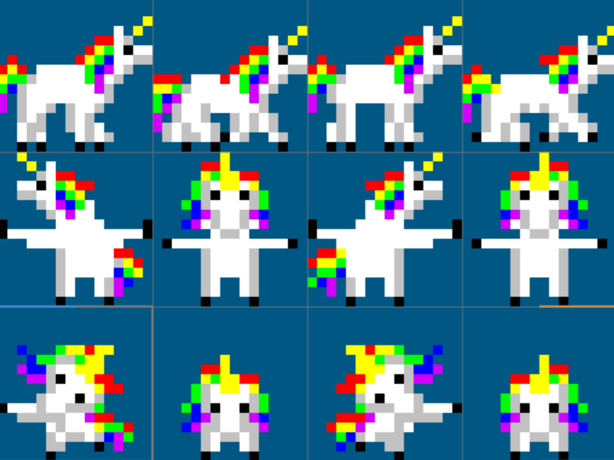

# Making of Lemmicorns

## 2026-08-13 - The theme is announced

The theme "Unicorns and Rainbows" was revealed, and the very first idea that came to my mind was "Lemmings, but with unicorns."

So I started to create a little prototype, trying if it is fast enough to use canvas.getImageData() for collision checks. turns out: yes.

The plan:
- use two (or even more) overlayed canvases
  - one to display the level and check the alpha-channel for collisions. This canvas also handles the destructible terrain by just deleting the pixels (setting alpha to zero)
  - one to render the other gameobjects (unicorns, starting area, target rainbow, effects)
  - maybe another one for gui...
- the levels will be defined by boxes that are filled prcedurally
- Lemmicorn-Actions
  - stopper (works like a wall for other unicorns)
  - diggers (horizontal, vertical, diagonal down)
  - rainbow builder (creates bridges)
  - time-bomb (special, applyable for all lemmicorns with all active actions, will destroy terrain in the area around the lemmicorn)
  - parachute (special, the lemmicorn falls slower, and survives any height)
- Lemmicorn abilities
  - walk in one direction, a wall-hit turns them around
  - a wall is at least 2 (3?) pixels high, otherwise the lemmicorn climbs up 
  - a drop of more that 100 pixels (to be definded) is lethal

## 2026-08-14 - Created Github repositoryand some art

Researched Lemmings gameplay. Turns out i forgot much about it. So much fun. And so much time consumed by playing Lemmings...

Started the spritesheet, this time not all images will be procedurally generated. animations for walking, stopping and digging done.

Also added a simple animation class to the game.

## 2026-08-15 - Walls and Stoppers, Diggers ans falling

The Lemmicorns are now turning around when hitting a wall or a stopper.

The Digger is now really digging a hole, by simply erasing the area around the Lemmicorn on the level canvas. I love it when a plan comes together!

Added another spriteanim for falling.

## 2026-08-16 - Lethal heights and horizontal digger

I added particles for effects: Lemmincorns that drop from too high now pop into a bunch of colored hearts upon impact.
The digging creates some mud-particles too.

Lemmicorns now can also dig horizontal. Next up: diagonally down

Final addition today: exploding Lemmicorns

## 2026-08-17 - noting

I fell asleep early with the children. No progress tonight... :-)

## 2026-08-18 - Buttons and Mousepointer

I added a buttonbar and buttons for the actions to choose.
Also a mouse handler, that calculates the proper position of the mouse over the pixelated canvas

## 2026-08-19 - buttons now have actions

the buttons can now be activated and clicking on lemmicorns triggers the buttons action